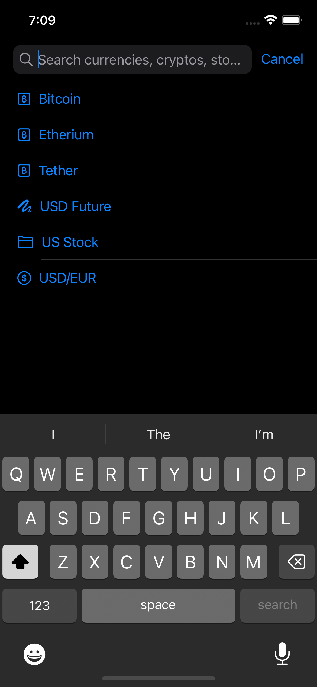

# Replicating search UI of the Stocks app

This use case is inspired by Apple‘s Stocks app. There is a local watchlist, which is empty initially, and the user can add assets to this watchlist by searching for the asset, search is performed by typing in the search field. API returns some search results that can be added to the watchlist by tapping on the plus button. If the asset is already in the watchlist, there would be a checkmark instead of a plus button, the checkmark is actually a button, and if the user taps on this button, then this asset would be removed from the watchlist.

This way watchlist could be edited while searching: adding and deleting multiple assets.

So this is a use case for searchable API, but not for the search of local items or items that are already presented in the list, but searching it by querying the API.

## Search suggestions

Search suggestions are active if the watchlist is empty.

## Tokens

The use of tokens is not utilized, the possible idea could be to use tokens as a way to broaden or narrow the search - another dimension in addition to Scope.

<iframe src="https://player.vimeo.com/video/753028951?h=cd902aec3f&amp;badge=0&amp;autopause=0&amp;player_id=0&amp;app_id=58479" frameborder="0" allow="autoplay; fullscreen; picture-in-picture" allowfullscreen style="position:absolute;top:0;left:0;width:100%;height:100%;" title="searchable_demo"></iframe>

To see tokens use case switch to the branch `tokens`.

## Structure

## References

* [dismissSearch](https://developer.apple.com/documentation/swiftui/environmentvalues/dismisssearch)
